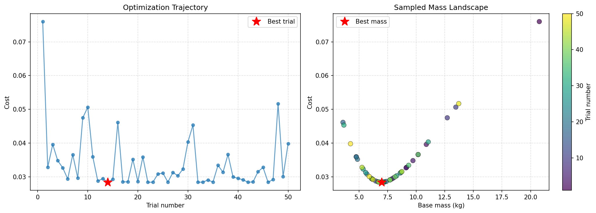

<h1 align="center"> Sampling-based System Identification with Active Exploration for Legged Robot Sim2Real Learning </h1>

<div align="center">

<h2 style="color: green;">CoRL 2025 (ORAL)</h2>  

[[Website]](https://lecar-lab.github.io/spi-active_/)
[[Arxiv]](https://arxiv.org/abs/2505.14266)
[[Video]](https://youtu.be/pxyig4D1ZFs)


[](https://developer.nvidia.com/isaac-gym) [](https://ubuntu.com/blog/tag/22-04-lts) []()


</div>

**SPI-Active** is a sampling-based **System Identification (SysID)** framework for **legged robots**, designed with **active exploration** to identify parameters of legged robots and therby reducing sim2real gap.  
This codebase implements the approach published in our CoRL 2025 paper.

Current codebase targets identification of the **base mass**, **center of mass (CoM)**, and **inertia parameters** of the **Unitree Go2 robot**, along with a modular **motor dynamics model**—enabling robust sim-to-real transfer for legged locomotion control.

Key features:
- **Hydra-powered configuration** for clean, modular experiment setup
- **Modular motor model classes** inheriting from a base environment for easy extensibility
- **Isaac Gym accelerated simulation** for fast sampling and evaluation

---

## TODO
- [x] Release SPI Code
- [x] Release Active Exploration code 
- [x] Release Downstream Task training code 
- [ ] Release Dataset Replay and Visualize code 
- [ ] Release Sim2real

---

## Table of Contents

1. [Installation](#Installation)
2. [System Identification Tools](#system-identification-tools)
3. [Running Active SysID](#running-active-sysid)
4. [Citing this Work](#bibtex)

---

## Installation

This codebase is built following the structure of [Humanoidverse](https://github.com/LeCAR-Lab/HumanoidVerse) and [ASAP](https://github.com/LeCAR-Lab/ASAP/tree/main?tab=readme-ov-file) codebases.

### Prerequisites
- Ubuntu 22.04 LTS (recommended)
- NVIDIA GPU with CUDA support
- Python 3.8
- uv installed: https://docs.astral.sh/uv/getting-started/
  - Quick install (Linux/macOS): `curl -LsSf https://astral.sh/uv/install.sh | sh`

### Installation with uv

## 1) Create a uv virtual environment (Python 3.8)
```bash
uv venv -p 3.8
source .venv/bin/activate
```

## 3) Install the repository

Clone the repository and from the repo root:
```bash
# Installs the workspace in editable mode and resolves dependencies
uv sync --dev
uv pip install -e isaac_utils/
```

### Install IsaacGym

Download [IsaacGym](https://developer.nvidia.com/isaac-gym/download) and extract:

```bash
wget https://developer.nvidia.com/isaac-gym-preview-4
tar -xvzf isaac-gym-preview-4
```

Install IsaacGym Python API:

```bash
uv pip install -e isaacgym/python
```

Test installation:

```bash
python 1080_balls_of_solitude.py  # or
python joint_monkey.py
```

For libpython error:

- Check conda path:
    ```bash
    conda info -e
    ```
- Set LD_LIBRARY_PATH:
    ```bash
    export LD_LIBRARY_PATH=</path/to/conda/envs/your_env/lib>:$LD_LIBRARY_PATH
    ```


## System Identification Tools

Tools for collecting trajectory data and identifying physical parameters (e.g., mass) in Isaac Gym.

### Data Collection

- **Note:** For `walk.py`, install [unitree_rl_gym](https://github.com/unitreerobotics/unitree_rl_gym) and place `walk.py` under `unitree_rl_gym/legged_gym/scripts/`.

```bash
# walk.py should be run from unitree_rl_gym/legged_gym/scripts/
python scripts/data/walk.py [--no-video]

# Other data collection scripts
python scripts/data/jump.py [--no-video]
python scripts/data/stand.py [--no-video]
python scripts/data/sine.py [--no-video]
```

### Mass Landscape

Visualize prediction error across different mass values:

```bash
python scripts/mass_landscape.py --config all --horizon 5 \
  --env-batch 2048 --project-dir logs/mass_landscape_all
```

### Mass Optimization

Find optimal mass using Bayesian optimization:

```bash
python scripts/mass_opt.py --config all --horizon 5 \
  --env-batch 4096 --project-dir logs/mass_opt_all
```

### Example Results

Configuration: `all`, horizon=5, 50 trials

```
Ground truth base mass: 6.921 kg
Optimal base mass: 7.006 kg
Best cost: 0.028378
```



## Running Active SysID

Detailed documentation in present in [Active-SysID](active_sysid.md)

> [!NOTE]
> Currently the command and dataset is for Unitree Go2. More details on setting up custom dataset, robot parameters and motor models will be released soon!

## Downstream Task Training 
We also provide training scripts to train the different downstream tasks we evaluate in our work. More details can be found in [Downstream-Tasks](spigym/envs/downstream_tasks.md)

# Citation
If you find our work useful, please consider citing us!

```bibtex
@InProceedings{pmlr-v305-sobanbabu25a,
  title = 	 {Sampling-based System Identification with Active Exploration for Legged Sim2Real Learning},
  author =       {Sobanbabu, Nikhil and He, Guanqi and He, Tairan and Yang, Yuxiang and Shi, Guanya},
  booktitle = 	 {Proceedings of The 9th Conference on Robot Learning},
  pages = 	 {578--598},
  year = 	 {2025},
  editor = 	 {Lim, Joseph and Song, Shuran and Park, Hae-Won},
  volume = 	 {305},
  series = 	 {Proceedings of Machine Learning Research},
  month = 	 {27--30 Sep},
  publisher =    {PMLR},
  pdf = 	 {https://raw.githubusercontent.com/mlresearch/v305/main/assets/sobanbabu25a/sobanbabu25a.pdf},
  url = 	 {https://proceedings.mlr.press/v305/sobanbabu25a.html},
}

```

# License

This project is licensed under the MIT License - see the [LICENSE](LICENSE) file for details.
